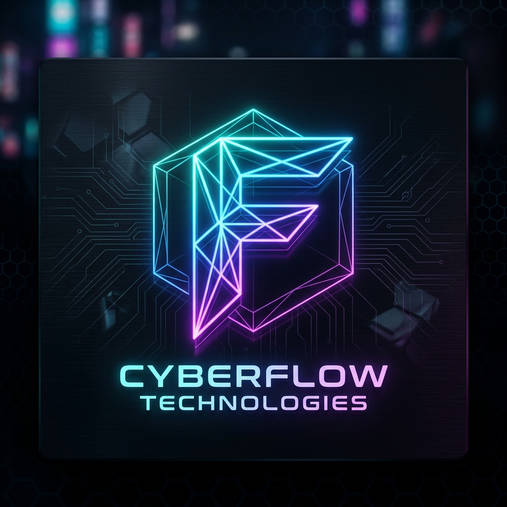
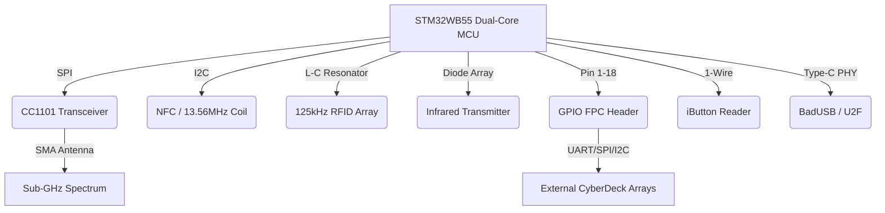

<p align="center">
  
</p>

<p align="center">
    <strong>[ CYBERFLIPPER : PRODUCTION RELEASE v1.2.0 ]</strong><br>
    <em>Maintained by Personfu @ <a href="https://fllc.net">fllc.net</a></em><br>
  <strong>Official Discord: <a href="https://discord.gg/Cd9qyvht7X">discord.gg/Cd9qyvht7X</a></strong>
</p>


<p align="center">
  <a href="https://docs.flipper.net/zero/development/hardware/schematic#"></a>
  <a href="https://docs.flipper.net/zero/development/hardware/schematic#"></a>
  <a href="https://docs.flipper.net/zero/development/hardware/schematic#"></a>
  <a href="https://docs.flipper.net/zero/development/hardware/schematic#"></a>
</p>

---

## ▓▒░ I. HARDWARE SCHEMATIC ARCHITECTURE
**CYBERFLIPPER** operates natively on the official [MAIN_PCB_12.1.F7B9C6](CYBERFLIPPER_BUILD/CYBERFLIPPER/MAIN_PCB_12.1.F7B9C6_Assembly.pdf) framework. It exploits the dual-core **STM32WB55** microprocessor, pushing the limits of the embedded CC1101 transceiver and physical HID bus arrays to create an autonomous, pocket-operable signal intercept pipeline. 

*(For raw engineering blueprints, cross-reference the official [Flipper Development Hardware Schematic](https://docs.flipper.net/zero/development/hardware/schematic#)).*



---

## ▓▒░ II. PROTOCOL VECTORS & TELEMETRY MATRIX

| Vector | Internal Silicon Driver | Attack / Capture Simulation Capabilities |
| :--- | :--- | :--- |
| **Sub-GHz** | CC1101 Transceiver | Operates <1GHz. Overrides ASK/OOK/GFSK/MSK. Captures/Synthesizes rolling codes (Keeloq, Somfy). Includes deep-passive listening nodes. |
| **125 kHz RFID** | LF L-C Tuned Circuit | Emulates low-frequency proximity gates (HID Prox, EM4100, Indala). |
| **NFC (13.56 MHz)** | ST25R3916 Controller | Parses MIFARE Classic/Ultralight, NTAG architectures, ISO-14443A/B, and FeliCa transit layers. |
| **Infrared** | Vishay TSSP / Diodes | Harvests ambient carrier frequencies. Modded universal dictionaries control HVAC / AV topologies. |
| **GPIO & Modules** | 3.3V FPC Header | Raw interface for UART (Pin 13/14), SPI (Pin 2/3/4/5), and I2C arrays to host external modules. |
| **iButton** | 1-Wire Interface (Pin 17)| Physical emulation of Dallas Contact memory (DS1990A). Replicates magnetic constraint locks. |
| **Bad USB** | Type-C USB PHY | Enumerates as standard Human Interface Device (HID). Executes Tier-8 hyper-speed .txt injection vectors (RubberDucky). |
| **U2F** | STM32 Crypto Engine | Fully validated FIDO U2F hardware cryptography key for authenticating advanced reverse-shells. |
| **Video Game Mod** | ESP32 / RP2040 | Video-out framework repurposed for advanced Wi-Fi penetration staging or secondary external display mapping. |

---

## ▓▒░ III. EDC ECOSYSTEM & TITAN MODULARITY
CYBERFLIPPER serves as the core bridging microcontroller representing the "Swiss Army Knife of cybersecurity tools" for an extensive Everyday Carry (EDC) loadout. We integrate directly with the greatest external penetration hardware on the market:

*   **Wireless Exploitation:**
    *   📡 **[ESP32 Marauder (JustCallMeKoko)](https://github.com/justcallmekoko/ESP32Marauder):** Pinned over UART TX(13) / RX(14). Essential 802.11 deauth mapping, beacon spamming, and PMKID capture.
    *   ⚡ **[Awake Dynamics ESP32-C5](https://awakedynamics.com/):** Next-generation 2.4/5GHz Wi-Fi overrides natively synthesized over the GPIO backbone.
*   **Rogue Signal & IMSI Detection:**
    *   🕵️‍♂️ **[Nyan Box](https://github.com/inAudible1/NyanBox):** Correlates Axon Camera network density to passively track law enforcement grids.
    *   📱 **[Ray Hunter](https://rayhunter.net/):** Verizon hotspot mod specifically dedicated to Stingray (Cell-Site Simulator) detection and IMSI catcher awareness.
*   **Captive Portals & Micro-Computing:**
    *   😈 **[M5Stick S3](https://docs.m5stack.com/en/core/m5stickc_plus2):** Running the "Evil" educational project for rapid captive-portal phishing emulation.
    *   🖥️ **[M5Stack Cardputer Advanced](https://shop.m5stack.com/products/m5stack-cardputer-esp32-s3-mini-keyboard-computer):** Running Porkchop firmware by Octo as a standalone serial analysis terminal.
*   **Spectrum Analysis & VHF/UHF Comms:**
    *   📻 **[HackRF Portapack H4](https://greatscottgadgets.com/hackrf/one/) & RTL-SDR:** Making the invisible world visible. When the Flipper's CC1101 bottlenecks, escalate to external 1MHz-6GHz SDR arrays via physical SPI bridging.
    *   🎙️ **[Quansheng UV-K5](https://github.com/egzumer/uv-k5-firmware-custom):** A highly capable, hackable handheld radio. The Flipper's GPIO serves as a programmable PTT interface to transmit encrypted digital APRS payloads.
*   **📡 [ProjectZero](https://github.com/C5Lab/projectZero) & OWASP Intelligence:** Integrated security logic and protocol manipulation derived from official Project Zero vulnerability mapping and the [OWASP CheatSheet Series](https://github.com/OWASP/CheatSheetSeries).
*   **🦆 Hak5 Tactical Payloads:** Native translation of master payload repositories: [USB Rubber Ducky](https://github.com/hak5/usbrubberducky-payloads), [WiFi Pineapple](https://github.com/hak5/wifipineapplepager-payloads), [Bash Bunny](https://github.com/hak5/bashbunny-payloads), and [OMG Cable](https://github.com/hak5/omg-payloads).
*   **🛠️ Cyber-Analytic Arrays:** Logic and conversion matrices sourced from [CyberChef (GCHQ)](https://github.com/gchq/CyberChef), [SecLists](https://github.com/Personfu/seclists), and [Awesome-Hacking](https://github.com/Hack-with-Github/Awesome-Hacking).
*   **🌍 Signal ISR (Intelligence, Surveillance, Reconnaissance):** Direct integration of cellular tower and satellite tracking logic via [Tower-Hunter](https://github.com/Ringmast4r/Tower-Hunter) and [GNSS](https://github.com/Ringmast4r/GNSS) frameworks.

> *We operate closely mapped alongside heavily customized smartphones and physical tools: **Nothing Phone 3** (Brute-force cloud processing), **Civivi Elementum Button Lock** (Physical override architecture), and the **Zebra F-701** (Tactical scribing).*

---

## ▓▒░ IV. NATIVE SOFTWARE TOPOLOGY
*   **PASSIVE_NODE Integrations:** Background mapping software (wardriver.c). Natively formats 802.11 / NMEA frames to .csv for direct database sync without external parsing.
*   **Flipper Mobile App & qFlipper Protocol:** Payload bloat removed. Designed to flash natively over qFlipper or directly via SD card insertion avoiding SPI watchdog timeouts.

---

## ▓▒░ V. HARDWARE TECHNICAL SPECIFICATIONS

> *Full specifications reference: [Official Flipper Zero Tech Specs](https://docs.flipper.net/zero/development/hardware/tech-specs) | [Hardware Schematics](https://docs.flipper.net/zero/development/hardware/schematic#)*

### 📐 Body

| Parameter | Value |
| :--- | :--- |
| **Materials** | PC, ABS, PMMA |
| **Height** | 40.1 mm (1.58 inches) |
| **Width** | 100.3 mm (3.95 inches) |
| **Depth** | 25.6 mm (1.01 inches) |
| **Weight** | 102 grams (3.6 ounces) |

### 🖥️ Display

| Parameter | Value |
| :--- | :--- |
| **Type** | Monochrome LCD |
| **Resolution** | 128×64 pixels |
| **Controller** | ST7567 |
| **Interface** | SPI |
| **Diagonal** | 1.4" |

### ⚙️ Microcontroller Unit (MCU)

| Parameter | Value |
| :--- | :--- |
| **Model** | STM32WB55RG |
| **Application Processor** | ARM Cortex-M4 32-bit @ 64 MHz |
| **Radio Processor** | ARM Cortex-M0+ 32-bit @ 32 MHz |
| **Radio** | Bluetooth LE 5.4, 802.15.4, Proprietary |
| **Flash** | 1024 KB (shared between application & radio) |
| **SRAM** | 256 KB (shared between application & radio) |

### 📡 Sub-1 GHz Module

| Parameter | Value |
| :--- | :--- |
| **Transceiver** | CC1101 |
| **TX Power** | -20 dBm max |
| **Frequency Bands** | 315 MHz · 433 MHz · 868 MHz · 915 MHz (region-dependent) |

### 📱 NFC (13.56 MHz)

| Parameter | Value |
| :--- | :--- |
| **Transceiver** | ST25R3916 |
| **Frequency** | 13.56 MHz |
| **Protocols** | ISO-14443A/B, NFC Forum |
| **Supported Cards** | MIFARE Classic®, Ultralight®, DESFire®, FeliCa™, HID iClass (Picopass) |

### 🔑 RFID 125 kHz

| Parameter | Value |
| :--- | :--- |
| **Frequency** | 125 KHz |
| **Modulation** | AM, OOK |
| **Coding** | ASK, PSK |
| **Supported Cards** | EM4100, HID H10301, Indala 26, IoProx XSF, AWID, FDX-A, FDX-B, Pyramid, Viking, Jablotron, Paradox, PAC Stanley, Keri, Gallagher, Nexwatch, Electra, Securakey |

### 🔌 GPIO

| Parameter | Value |
| :--- | :--- |
| **I/O Pins** | 13 available on external 2.54mm connectors |
| **Logic Level** | 3.3V CMOS |
| **Input Tolerance** | 5V tolerant (See AN4899) |
| **Max Current** | Up to 20 mA per digital pin |

### 🔴 Infrared

| Parameter | Value |
| :--- | :--- |
| **RX Wavelength** | 950 nm (±100 nm) |
| **RX Carrier** | 38 KHz (±5%) |
| **TX Wavelength** | 940 nm |
| **TX Carrier** | 0–2 MHz |
| **TX Power** | 300 mW |
| **Protocols** | NEC, Kaseikyo, RCA, RC5, RC6, Samsung, SIRC |

### 🗝️ iButton 1-Wire

| Parameter | Value |
| :--- | :--- |
| **Protocols** | Dallas DS199x, DS1971, CYFRAL, Metakom, TM2004, RW1990 |

### 🔋 Battery

| Parameter | Value |
| :--- | :--- |
| **Type** | Lithium Polymer (LiPo) |
| **Capacity** | 2100 mAh |
| **Battery Life** | Up to 28 days |
| **Operating Temp** | 0° to 40°C (32° to 104°F) |

### 💾 MicroSD Card

| Parameter | Value |
| :--- | :--- |
| **Max Capacity** | Up to 256 GB |
| **Recommended** | 2–32 GB |
| **Interface** | SPI |
| **R/W Speed** | Up to 5 Mbps |

### 🔗 USB

| Parameter | Value |
| :--- | :--- |
| **Connector** | Type-C |
| **Standard** | USB 2.0 |
| **Data Speed** | 12 Mbps |
| **Max Charge** | 1 A |

### 📶 Bluetooth LE 5.4

| Parameter | Value |
| :--- | :--- |
| **TX Power** | 4 dBm max |
| **RX Sensitivity** | -96 dBm |
| **Data Rate** | 2 Mbps |

### 🔊 Buzzer & Vibration

| Parameter | Value |
| :--- | :--- |
| **Buzzer Frequency** | 100–2500 Hz |
| **Sound Output** | 87 dB |
| **Buzzer Type** | Coin |
| **Vibration Force** | 30 N |
| **Vibration Speed** | 13500 rpm |

---

---

## ▓▒░ VII. BRANDING & ASSET PIPELINE
### 🎨 Custom Animation Standards
CYBERFLIPPER uses the **F-SERIES** bitmap specification. To create custom animations for the intelligence deck:
1. **Design:** Use Aseprite or Photoshop for 128x64 pixel art.
2. **Compile:** Convert PNG frames to `.bm` using `asset_packer.py`.
3. **Register:** Add your animation to `/dolphin/manifest.txt` with a designated weight.

### 🔗 Contributor Uplink
Join the **F-SERIES** core on Discord for development blueprints:
➡️ **[https://discord.gg/Cd9qyvht7X](https://discord.gg/Cd9qyvht7X)**

---
<p align="center">&copy; 2026 FurulieLLC | Personfu | NEON_DUSK_PROTOCOL</p>

## ▓▒░ VIII. APPENDIX: FLIPPER ANIMATION ARCHITECTURE
*A technical guide for the CyberFlipper Neural Interface.*

### 🛠️ SOFTWARE TOPOLOGY
**Local Engineering:**
1. **Aseprite** (Primary)
2. **Adobe Photoshop** (High Fidelity)
3. **GIMP / Microsoft Paint** (Legacy)

**Web-Link Arrays:** EzGIF, Piskel, Lopaka, Photopea.

### 📂 FILE STRUCTURE PROTOCOLS
**CFW (Custom Firmware) Standard:**
```text
Animation_Pack_Name/
    ├── Anims/
    │   ├── Animation_1/
    │   │   ├── frame_0.bm
    │   │   ├── frame_1.bm
    │   │   └── meta.txt
    │   └── manifest.txt
    └── Icons/
        └── Passport/
            └── passport_128x64.bmx
```

### ⚙️ COMPILATION VECTORS
Use `compile_assets.py` or official FBT logs to debug:
- `log debug`: The optimal verbosity for signal analysis.
- `log trace`: High-intensity telemetry (overwhelming).

*For errors regarding 'frames order', verify the passive/active frame counts in your meta.txt against the .bm library.*
